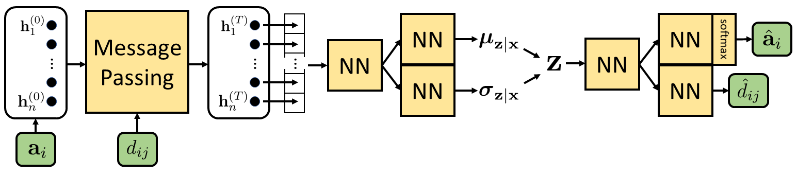

# DeepMol – Deep Learning-Based Property Prediction and Generation of Molecules
A TensorFlow implementation of deep learning models for property prediction and generation of molecules,
featurized by atom types and molecular geometry, trained on the 
[QM9 data set](https://figshare.com/collections/Quantum_chemistry_structures_and_properties_of_134_kilo_molecules/978904).
Written for my master's thesis at Freie Universität Berlin. 

##### Requirements
- tensorflow
- sklearn
- numpy, scipy
- rdkit
- pybel, openbabel

##### Data Set
A shuffled and partitioned version of the data set that is ready-to-use for this project can be downloaded 
[here](https://www.dropbox.com/s/pag6sivg0yzgndy/QM9.zip?dl=0).

## Message Passing Neural Network
Property Prediction is performed with a message passing neural network
(MPNN, see [Neural Message Passing for Quantum Chemistry](https://arxiv.org/pdf/1704.01212.pdf)):

- A hidden state vector is assigned to each atom. 
- Based on their interatomic distance, the atoms "pass messages" to each other via continuous convolutions.
- A Gated Recurrect Unit is used to update the hidden states based on the incoming messages.
- After multiple message passes, a read-out function (based on an LSTM and an attention mechanism) creates a
vector embedding of the molecule which can be mapped to the respective property. 

With implicit hydrogen and on a test set of 10k molecules, the model achieved a mean absolute error of 0.42kcal/mol on
atomization energy.

Use train_mpnn.py to run trainings and evaluations.

## Molecular Variational Autoencoder
A message passing-based encoder is extended by a fully-connected neural network decoder (see figure below).

When using it as an autoencoder,
the model reconstructs heavy atoms with an accuracy of 99.9% and atom positions with a mean absolute error of 0.05Å.

When sampling molecules from the latent prior in VAE mode, the atoms have a mean absolute deviation of 0.4Å
from their position after a DFT-based geometry optimization.

##### Loss
- atom types: cross entropy
- distances: mean squared error, weighted by the probability that the involved atoms exist in both molecules
- geometry: an additional term penalizes violations of the triangle inequality.
It did not turn out to improve model performance though

##### Evaluation
- reconstruction accuracy of atom types
- reconstruction error of atom positions
- SMILES accuracy: for original and reconstruction, infer bonds, generate SMILES and compare
- generated mols: DFT-based geometry optimization is performed using orca (see respective notebook)

Use train_vae.py to run trainings and evaluations.
To use the model as an autoencoder, set the parameter _variational_ to false.

